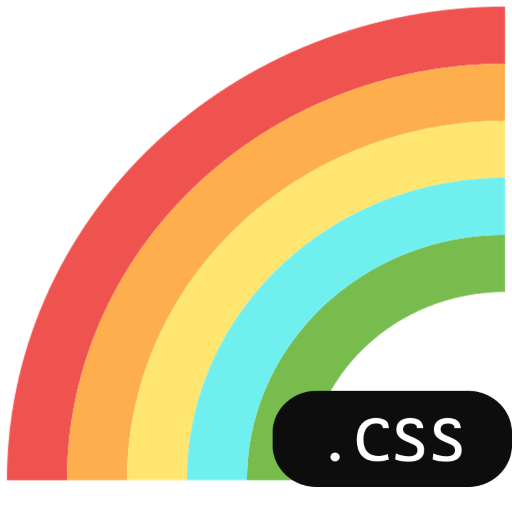

# Rongila.css 

A class based css librarary built with animations and responsiveness in mind😍

**version: 0.2.1**


<p align="center"></p>

## Features - 
<ol>
<li> Written in vanilla css✔</li>
<li> Simple class based usage😄</li>
<li> lightweight(<30KB)🐱‍🏍</li>
<li> Easy to use animations & hover effects🤯</li>
</ol>

## Installation - 

```html
<link rel="stylesheet" href="https://cdn.jsdelivr.net/gh/TriptoAfsin/rongila-css@2.09/rongila.css">
```

<h2>🌍Demo Site: <a href="https://triptoafsin.github.io/rongila-css/"> Visit </a></h2>

<h2>Usage instructions - </h2>

<h3><a href="https://rongila.netlify.app/">⚡Full Documentation⚡</a></h2>

### Example 1(Text Sizes) - 

```html
<p class="txt-sm center-txt">Small text</p>
<p class="txt-med center-txt">Med text</p>
<p class="txt-lg center-txt">Lg text</p>
<p class="txt-xl center-txt">XL text</p>
```  
<p>Output - </p>


### Example 2(Card) - 
``` html
<div class="card-container">
    <div class="card">
        <p class="card-title">Card Title</p>
        <p class="card-subtitle">Card Subtitle😎</p>
        <p class="card-txt">Card txt, 12,3,45, Dhaka Bangladesh</p>
        <button class="card-btn pad2 right">CLick Me</button>
    </div>
</div>
```
<p>Output - </p>


### Example 3(Footer, Columns, Rows) - 

```html
<footer class="shadow grey">
        <div class="column">
            <p class="txt-xl">Rongilla CSS</p>
            <p class="txt-med">Yet another class based css library</p>
            <p>All rights reserved by: Tripto Afsin ©2020</p>
        </div>
        <div class="column">
            <p class="txt-lg">Browse</p>
            <a href="https://www.facebook.com/">Home</a>
            <a href="https://www.facebook.com/">Browse</a>
            <a href="https://www.facebook.com/">About</a>
        </div>
        <div class="column">
            <p class="txt-lg">Sign up for newsletter</p>
           <input type="email" placeholder="Email" class="no-animation">
        </div>
        <div class="column">
            <p class="txt-lg">Address</p>
            <p>Dhaka, Bangladesh</p>
        </div>
        <div>
            <p class="txt-lg">Follow us</p>
            <a href="https://www.facebook.com/"></img></a>
            <a href="https://twitter.com/?lang=en"></img></a>
            <a href="https://www.instagram.com/"></img></a>
        </div>
    </footer>
```
<p>Output - </p>

    